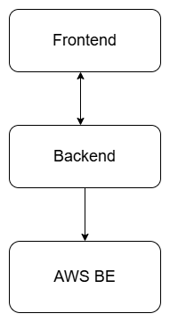
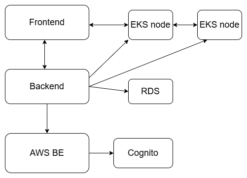
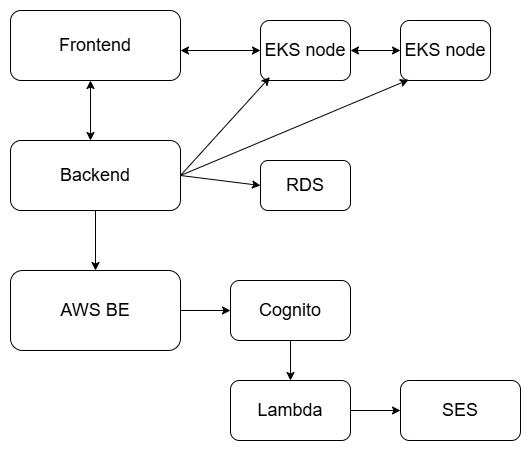
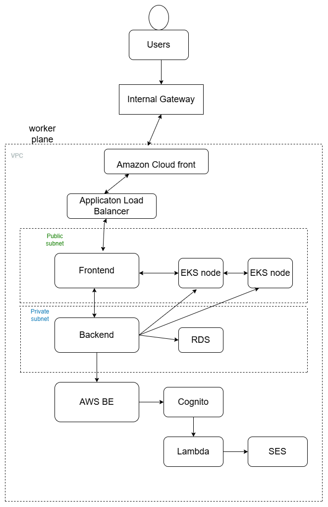

# System Design Diagrams Explanation

## 1. **System Context Diagram**
   
1. **Frontend** sends requests (e.g., login, data retrieval) to the **Backend**.
2. **Backend** processes these requests, interacts with the **AWS Backend**, and retrieves necessary data or performs tasks.
3. **AWS Backend** supports backend operations with storage and external services.
4. Processed data or responses are sent back from the **Backend** to the **Frontend** for display.

## 2. **Container Diagram**
   ### **Interaction Flow**:
1. **Frontend** interacts with the **EKS Node (Frontend)** to process user inputs.
2. **EKS Node (Frontend)** communicates with **EKS Node (Backend)** for data and logic processing.
3. **EKS Node (Backend)** interacts with **RDS** for database queries and **Cognito** for user authentication.
4. Responses flow back through the **EKS Nodes** to the **Frontend** for user display.

## 3. **Component Diagram**
  
1. **Frontend** interacts with **EKS Node (Frontend)** to handle user input and display data.
2. **EKS Node (Frontend)** sends requests to **EKS Node (Backend)** for processing business logic.
3. **EKS Node (Backend)** communicates with **RDS** to retrieve/store data and **Cognito** for user authentication.
4. **AWS Lambda** may be triggered for additional processing, such as sending notifications or automating tasks.
5. **AWS SES** is used to send email notifications to users based on backend events (e.g., registration, password reset).
6. Processed data and responses are sent back through **EKS Nodes** to the **Frontend** for user display.

## 4. **Code Diagram**
 
1. **Users** interact with the **Frontend**, which is served via **Amazon CloudFront** for improved performance.
2. The **Frontend** sends requests through the **Internal Gateway** to the **EKS Node (Backend)** for business logic processing.
3. **EKS Node (Backend)** communicates with **RDS** to retrieve/store data and uses **Cognito** for user authentication.
4. **AWS Lambda** may be triggered to handle background tasks (e.g., notifications, data processing).
5. **AWS SES** sends transactional emails based on backend events (e.g., password resets).
6. **Application Load Balancer (ALB)** distributes incoming traffic across the backend services for improved availability and scalability.
7. Responses from the backend are sent back through the **Internal Gateway** and **Frontend** for user display.

